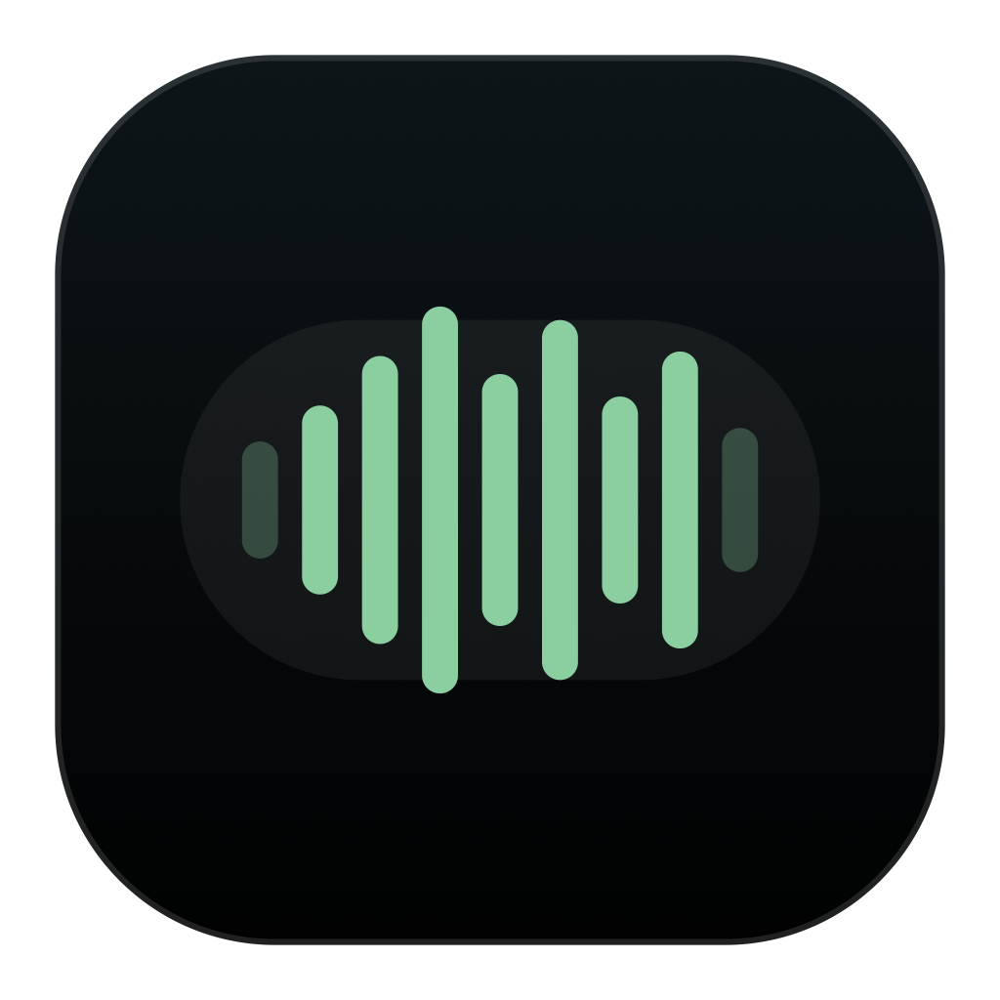

<p align="center">
  
</p>

# Voiced

Voiced is a local capture layer for macOS: speak it, select it, or type it, then paste it, queue it, or keep it. It combines local Whisper transcription with selected-text capture, typed prompts, a native review surface, and a persistent shelf.

## Capture

- Hold Right Command to transcribe into the previously focused editor. Successful insertion moves the capture to Done and restores the previous clipboard when it remains unchanged.
- Hold Shift + Right Command to record, then release to save quietly to Inbox; the notch confirms when it is ready.
- Press Shift twice to capture the current selection.
- Press Option-Space to open or close the shelf.
- Type directly into the shelf to add a capture.
- Edit, search, preview transcript refinements, export reminders, copy, drag, move, or remove captures in the shelf detail pane. Refinements are applied only after review and can be undone.
- Inbox and Done persist across launches. Removed captures offer an immediate Undo action.
- Automatic insertion restores the previous clipboard when it has not changed during the operation.

Voice, selection, and typed input all produce the same `CaptureItem`. Captures are stored as readable JSON at:

```text
~/Library/Application Support/Voiced/Captures.json
```

Writes are atomic. If the file is corrupt, Voiced preserves a timestamped recovery copy before starting an empty shelf.

## Privacy

Voiced has no account, telemetry, analytics, cloud storage, server, or cloud transcription path. Capture text, transcript text, clipboard contents, application window titles, and other sensitive material are not logged.

Network access is used only after an explicit local speech-model download request. Temporary audio is deleted after transcription or cancellation. Downloaded models are verified against pinned SHA-256 manifests before loading.

## Requirements

- macOS 14 or newer.
- Microphone access for voice capture.
- Accessibility for selected-text access and automatic insertion.
- Input Monitoring for global modifier gestures and shortcuts.
- Xcode with Swift 6 support and XcodeGen for development.

The onboarding flow, shelf, settings, and menu all expose recoverable permission actions. Voiced never resets TCC or changes privacy settings itself.

## Development

`project.yml` is the source of truth for the generated Xcode project.

```sh
xcodegen generate
xcodebuild -project Voiced.xcodeproj -scheme Voiced -configuration Debug build
xcodebuild -project Voiced.xcodeproj -scheme Voiced -configuration Release build
xcodebuild -project Voiced.xcodeproj -scheme Voiced -configuration Debug test
```

Build, install to the stable `dist/Voiced.app` path, sign with a local Apple Development identity when available, and launch:

```sh
./script/build_and_run.sh
```

See [docs/local-build.md](docs/local-build.md) for local permission testing and [docs/manual-smoke-checklist.md](docs/manual-smoke-checklist.md) for end-to-end verification.

## Direct Distribution

The Mac App Store is not a supported distribution target. Release builds are unsandboxed and use Hardened Runtime so global capture, Accessibility selection, and insertion can work reliably.

Publish a signed, notarized GitHub Release from the local Mac:

```sh
./script/publish_release.sh
```

The publisher validates the version and checkout, runs tests, uses credentials stored in the local Keychain, signs and notarizes the app, creates the version tag when needed, and uploads the ZIP and checksum. No GitHub Actions signing secrets are required. See [docs/direct-distribution.md](docs/direct-distribution.md).

## Repository Layout

- `Voiced/Capture/`: capture model, persistence, source application tracking, and selected-text capture.
- `Voiced/Output/`: clipboard transactions and automatic insertion.
- `Voiced/Permissions/`: global event tap, gesture recognition, and permission state.
- `Voiced/UI/`: shelf, generic review surface, settings, onboarding, and menu bar UI.
- `Voiced/Audio/` and `Voiced/Models/`: local Whisper transcription and model management.
- `VoicedTests/`: persistence, recovery, gesture, and clipboard-safety tests.
- `script/`: local run and direct Release packaging workflows.
- `website/`: public product site.

## License

Voiced is released under the [MIT License](LICENSE).
