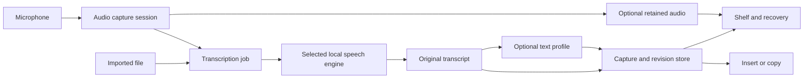

**Voiced: Sotto comparison and product roadmap**

Research date: 17 September 2026. Voiced baseline: commit `ece2ee1`, app version 0.1.7.

**Revised scope following the owner's clarification.** Voiced is a personal, English-only tool. The active plan is now better English recognition with Parakeet v2, an editable personal vocabulary, restoration of live transcription in the previous cursor-adjacent panel, and Command + Shift + Space for dictation. Target both M1 Max and M1 Pro Macs with 32 GB RAM. The broader comparison below remains research background; its release programme, multilingual work and 8–12 week estimate do not apply to this personal scope.

The development Mac inspected here is an Apple M1 Max with 32 GB RAM, initially running macOS 26.6.2 and subsequently upgraded to macOS 27.0 for full Xcode validation. It meets the published Apple Silicon/macOS requirements for [FluidInference's Core ML conversion of Parakeet TDT 0.6B v2](https://huggingface.co/FluidInference/parakeet-tdt-0.6b-v2-coreml). This route runs locally and does not require an NVIDIA GPU or a cloud service. The implementation now includes a Parakeet adapter alongside WhisperKit; real microphone and M1 Pro acceptance checks remain necessary.

**The focused implementation plan is:**

1. Add FluidAudio and an explicitly selected Parakeet v2 backend behind `AppTranscribing`. Its documented model loader accepts `.v2`. Load the model once, capture 16 kHz mono audio and return the final transcript through the existing insertion/shelf flow. Keep the current Whisper option available for comparison. [FluidAudio ASR guide](https://github.com/FluidInference/FluidAudio/blob/main/Documentation/ASR/GettingStarted.md)
2. Restore the cursor panel from Git history, adapting it to the current coordinator and shelf. `Voiced/UI/CursorMicroIndicator.swift` exists at `c45e100^` and was deleted in `c45e100` on 12 August 2026. It includes `showLiveTranscriptAtCursor`, `updateLiveTranscript` and `showReviewAtCursor`; the panel was anchored near the mouse pointer. Recover its relevant components rather than reverting the surrounding app to the old revision.
3. Connect live updates to that panel. Parakeet TDT v2 is a batch model; progressive text requires repeated decoding of buffered/overlapping audio. Choose a preview cadence that feels responsive on this Mac, with provisional text allowed to change and a final pass on release. FluidAudio documents a sliding-window path; verify v2 compatibility in the pinned SDK before relying on it. A waveform followed only by final text would be an incomplete restoration of the requested live UX. [FluidAudio model modes](https://github.com/FluidInference/FluidAudio/blob/main/Documentation/Models.md)
4. Add a local vocabulary editor in Settings: add, edit and remove words or phrases, retain preferred spelling, and save across launches. Start with the existing terms as editable defaults. Whisper receives a bounded list as prompt tokens. For Parakeet v2, FluidAudio documents vocabulary boosting using a separate CTC encoder and audio-based rescoring. Integrate that path for the final pass first and measure whether it is also suitable for live previews; account for the extra model download. Do not silently substitute naive find-and-replace for recognition hints. [FluidAudio custom vocabulary](https://github.com/FluidInference/FluidAudio/blob/main/Documentation/ASR/CustomVocabulary.md)
5. Try roughly 10–20 ordinary personal dictations, including technical names, with v2 and the existing Turbo model. Compare corrections needed, live-preview behaviour and the delay after releasing the key. Tune for the user's voice and microphones on the M1 Max and M1 Pro, both with 32 GB RAM. Preserve the working clipboard handling and cancellation behaviour.

Parakeet v2 supplies English recognition with punctuation and capitalisation; it does not itself replace the text-refinement model. Existing local cleanup can remain a separate action. [NVIDIA model card](https://huggingface.co/nvidia/parakeet-tdt-0.6b-v2)

The target flow is: hold Command + Shift + Space → see words appear beside the cursor while speaking → release → final recognition with the personal vocabulary → insert. Add Option to save to Inbox instead of inserting. Escape cancels. Optional automatic cleanup is available in AI settings, preserving the original transcript. Preview is the default; experimental Direct mode updates a checked range in supported fields and retains the result for copying if the destination changes.

Implementation work now includes FluidAudio 0.15.7, Parakeet v2 with CTC vocabulary rescoring, persistent vocabulary editing, a nonactivating live transcript panel, Preview/Direct modes, optional local cleanup with original recovery, and the new shortcuts. XcodeGen is installed. After the macOS upgrade, the full Xcode 27.0 (27A266a) build and actual XCTest run passed: all 39 tests, zero failures. This supersedes the earlier temporary assertion-harness check and removes the Xcode licence blocker. Native settings and setup views were previously inspected in an isolated preview app; vocabulary saving survived relaunch, tab labels fit, and the five-model setup list no longer overlaps permissions. No microphone permissions were changed.

The normal build/run script now stages, signs, verifies and launches `dist/Voiced.app` successfully on macOS 27. It finds the standard Xcode install when Command Line Tools remain selected. For the staged local app it disables Xcode's separate debug dylib, which otherwise fails hardened-runtime library validation with an ad-hoc signature. No entitlement relaxation or system-wide toolchain change is needed. The installed app's setup, shortcut/Preview settings and six-term vocabulary editor were inspected after launch. Parakeet v2 and its vocabulary model loaded successfully; Settings reports “Loaded · Ready to dictate” and 567.2 MB on disk. Microphone, Accessibility and Input Monitoring still show as needed, so real microphone/insertion acceptance remains pending those user grants.

**Implementation validation and choices.** On this M1 Max, an 8.264-second generated English recording produced the expected final transcript with Parakeet v2. The speech decode took about 0.21 seconds after model loading; that is not an end-to-end microphone/AI-cleanup measurement or an M1 Pro benchmark. Speech and CTC weights are downloaded locally (about 550 MiB combined). Initial Core ML preparation in the test took about 54 seconds; rerunning the unchanged binary loaded cached models in about 0.62 seconds. The app retains the loaded backend between dictations.

Short sliding windows split words in the synthetic check, so the implemented preview periodically re-decodes the growing utterance and keeps it provisional. It runs one inference at a time; cadence slows for longer recordings. A fresh final decode uses the whole recording and then conservative CTC vocabulary rescoring. The SDK’s default vocabulary scoring incorrectly substituted a specialist term for ordinary speech in the check; minimum similarity is now 0.8, short-term tapering is enabled, and acoustic rescue is disabled. This trades aggressive rare-word correction for fewer false substitutions. The tuned check preserved the correct ordinary phrase.

See the manual smoke checklist for actual microphone/editor acceptance, longer dictations and the M1 Pro comparison.

**Earlier broad product comparison, retained for reference.**

Voiced can become a competitive daily dictation tool without replacing its foundation. The highest-value work is improving first-use accuracy, making vocabulary and dictation modes configurable, preserving recoverable work, and measuring whether text reaches the intended editor. Additional engines should earn their place through benchmarks.

Recommended positioning: **Private dictation that puts usable text where you need it, with a shelf for everything worth keeping.** Preserve voice, selection, typed capture, Inbox/Done, and local refinement as differentiators.

This plan assumes local-only operation remains the core product promise. Cloud services are assessed separately as an optional later extension. This is a roadmap, not an implementation or a commitment to change that promise.

**Evidence and limits.** I inspected Sotto's live website, public documentation and marketing, Voiced's source and checked-in screenshots, and upstream framework documentation. I did not run comparative audio tests or install Sotto. Its [gallery](https://sotto.to/gallery/) currently has no app screenshots, and its [download page](https://sotto.to/download/) says the download is not public and links to an access service. Website demonstrations therefore establish advertised workflows, not measured reliability or production UI quality. Absence from the website is not proof that Sotto lacks a feature.

**The capability comparison.** The Sotto column records advertised capabilities; the Voiced column reflects the inspected implementation.

| Capability | Sotto advertises | Voiced today | Recommended action |
|---|---|---|---|
| System-wide dictation | Hold or toggle, configurable shortcuts. [Workflow](https://sotto.to/blog/how-to-dictate-into-any-mac-app/) | Fixed Right Command hold gesture; Shift variant saves to Inbox; clipboard restoration. | Add configurable hold/toggle modes; validate delivery across target apps. |
| Local recognition | Whisper and Parakeet v2/v3. [Models](https://sotto.to/blog/whisper-vs-parakeet/) | WhisperKit: Tiny, Base, Small and a compressed Turbo variant labelled Large v3. | Improve the default before expanding the model catalogue; benchmark Parakeet. |
| Language selection | 90+ languages, detection and language shortcuts. [Product](https://sotto.to/) | Decoder explicitly requests English; smaller models are English-only. | Add locale and auto-detection settings, checked against model capabilities. |
| Personal vocabulary | Editable recognition hints. [Import guide](https://sotto.to/blog/transcribe-audio-to-text-offline-mac/) | Six hard-coded terms are already passed as prompt tokens. | Expose a persistent user dictionary and test its effect. |
| Text refinement | Automatic rules and selectable AI functions. [Product](https://sotto.to/) | Three on-device actions in shelf review: cleanup, summary, to-do list. | Add optional cleanup before insertion, then saved custom profiles. |
| Recovery and history | Search, replay and rerun recognition. [Import guide](https://sotto.to/blog/transcribe-audio-to-text-offline-mac/) | Searchable, persistent text shelf; no durable audio attachment or recognition revisions. | Add retention-controlled audio and revision history. |
| Audio imports | File drop and import shortcut. [Import guide](https://sotto.to/blog/transcribe-audio-to-text-offline-mac/) | A file transcription method exists, but no user-facing import workflow. | Connect it to a cancellable import queue and the existing shelf. |
| Cloud options | BYOK transcription and multiple AI providers. [Product](https://sotto.to/) | None; no account or application server. | Optional later decision, not a dependency of the local roadmap. |
| Capture beyond speech | Not established in inspected material. | Selection, typed capture, source-app context and Reminders export. | Preserve and explain these advantages. |

Sotto lists a $49 one-time licence for three Macs with lifetime updates. Voiced is MIT licensed. Pricing alone does not establish quality; do not add licensing infrastructure to the engineering roadmap without a separate commercial decision. [Sotto pricing](https://sotto.to/#pricing)

**What can be established about Sotto's technology.** Its website explicitly names Swift/SwiftUI, WhisperKit, local Parakeet, OpenAI/Groq transcription and external LLM providers for text processing. It says cloud audio goes directly to the chosen provider. [Sotto product](https://sotto.to/)

The likely architecture is microphone capture → speech recognition → optional text transformation → insertion, backed by local recording history. AVFoundation, macOS Accessibility and clipboard/event integration would be conventional implementation choices, but the site does not verify its exact capture or insertion code. Its database, credential storage, runtime versions and failure handling remain unknown. I found no evidence requiring a proprietary speech model to explain the advertised functionality.

For a Voiced Parakeet prototype, [FluidAudio](https://github.com/FluidInference/FluidAudio) is a concrete Swift/Core ML integration candidate. That is a recommendation, not evidence that Sotto uses it. Its model documentation distinguishes batch/sliding-window Parakeet TDT processing from true streaming models; throughput on a long file must not be mistaken for short-dictation response time. [FluidAudio model catalogue](https://github.com/FluidInference/FluidAudio/blob/main/Documentation/Models.md)

Treat model performance claims as hypotheses. Local compute placement varies by model and configuration; cloud inference happens remotely. Download sizes do not establish peak memory consumption. Test each supported device, locale and model combination before promising compatibility.

**Seven findings in Voiced that change the priorities.**

1. **A stronger model is already present.** `large-v3-v20240930_626MB` is identified upstream as compressed Large v3 Turbo. Rename its presentation accurately while preserving the stored identifier. Benchmark it as the recommended everyday option. The current default is `.tiny`, which optimises the initial download rather than necessarily the first useful result. Argmax describes Tiny as a development/debugging choice. [Model configuration](/Users/rufus/Apps/voiced/Voiced/Audio/TranscriptionModel.swift:6), [default](/Users/rufus/Apps/voiced/Voiced/App/SettingsStore.swift:52), [upstream model guidance](https://github.com/argmaxinc/argmax-oss-swift#model-selection)

2. **Compute configuration deserves measurement.** Base, Small and Large explicitly use `.cpuAndGPU` for all three configured stages. Compare this with the upstream defaults and supported Neural Engine configurations. Do not flip every stage to ANE without checking warm-up, sustained latency, power and stability. [Compute options](/Users/rufus/Apps/voiced/Voiced/Audio/TranscriptionModel.swift:97)

3. **Vocabulary and language are small but valuable gaps.** Prompt token support is implemented; it needs user settings and a bounded prompt policy. Language is hard-coded to `en`, including for the multilingual-capable larger model. Adding a language picker alone would be insufficient: `.en` models must reject or offer a suitable replacement for other languages. A dictionary is a hint, not a guarantee or fine-tuning. [Vocabulary implementation](/Users/rufus/Apps/voiced/Voiced/Audio/TranscriptionVocabulary.swift:3)

4. **Live text exists internally but is not displayed in the active flow.** The coordinator passes an empty transcript-update closure and consumes only audio level updates. Offer an optional compact live preview without taking keyboard focus. The existing migration document's claim that live preview is current product behaviour needs qualification. [Recording callback](/Users/rufus/Apps/voiced/Voiced/App/AppCoordinatorLive.swift:201)

5. **Audio recovery needs a real data model.** `CaptureItem` contains text, dates, status and application metadata. It does not contain an audio reference, recognition engine, language, duration or original transcript. Live transcription currently operates on buffered samples; the existing file method is not a recording archive. Persisting audio therefore requires capture lifecycle work, not merely a Play button. [Capture model](/Users/rufus/Apps/voiced/Voiced/Capture/CaptureItem.swift:71), [transcription service](/Users/rufus/Apps/voiced/Voiced/Audio/TranscriptionService.swift:333)

6. **AI is already implemented, but is a review action.** Foundation Models powers three profiles on supported macOS 26+ systems when Apple Intelligence and the locale are available. The immediate gap is integration into the dictation path. Raw text must survive model failures, unsupported devices and lengthy input. The current fixed output budgets also need validation before applying cleanup to long imports. [Processing service](/Users/rufus/Apps/voiced/Voiced/App/TranscriptProcessingService.swift:10), [review UI](/Users/rufus/Apps/voiced/Voiced/UI/CaptureShelfDetailView.swift:336)

7. **Insertion success is currently optimistic.** `OutputManager` returns `.inserted` after posting Command-V and waiting; it does not establish that the target accepted text. The coordinator then moves the item to Done. This is a reliability risk to investigate, not evidence of an observed failure. Track dispatch separately from verified delivery where verification is possible; retain recovery and avoid automatic retries that could duplicate text. Test source-app termination and focus changes explicitly. [Insertion](/Users/rufus/Apps/voiced/Voiced/Output/OutputManager.swift:29), [capture completion](/Users/rufus/Apps/voiced/Voiced/App/AppCoordinatorLive.swift:259)

**Correct the Apple Speech migration assumptions before implementing them.** [The existing plan](/Users/rufus/Apps/voiced/docs/speechanalyzer-migration-plan.md:59) unnecessarily treats macOS 27 as the minimum for live Apple Speech. Apple's WWDC25 example already feeds live AVAudioEngine audio through format conversion into SpeechAnalyzer. SpeechAnalyzer and SpeechTranscriber are available from macOS 26. [Apple live transcription example](https://developer.apple.com/videos/play/wwdc2025/277/), [SpeechAnalyzer](https://developer.apple.com/documentation/speech/speechanalyzer)

Apple's documentation metadata, checked during this research, places `CaptureInputSequenceProvider`, `AnalyzerInputConverter` and `AssetInputSequenceProvider` at macOS 27. These newer helpers simplify input plumbing; they do not set the minimum for all live or file transcription. Prototype macOS 26 using AVAudioEngine/AVAudioConverter and analyzer inputs; adopt the helpers only on supported systems. In particular, do not use `AssetInputSequenceProvider` in a macOS 26-only branch. Keep runtime device, locale and asset checks. [Capture helper](https://developer.apple.com/documentation/speech/captureinputsequenceprovider), [converter](https://developer.apple.com/documentation/speech/analyzerinputconverter), [file helper](https://developer.apple.com/documentation/speech/assetinputsequenceprovider)

**Build around the existing service boundaries.** Keep SwiftUI/AppKit, `AppTranscribing`, `TranscriptProcessing`, `OutputPerforming` and the shelf. Evolve these incrementally:

- Introduce a transcription request carrying locale, vocabulary and a snapshot of the selected model. Return text plus engine/model, duration and optional segment timing. Separate final text, partial results, cancellation and failure status.
- Describe backend capabilities explicitly: live/file support, locales, vocabulary support, timestamps, minimum OS and required assets. Do not assume every backend supports every option.
- Keep a single microphone owner. Start with the existing WhisperKit path; extract app-owned audio capture only as the second backend or retained-audio work requires it. Avoid two independent microphone sessions.
- Extend captures with optional audio metadata, immutable original text and revisions. Existing captures must continue to decode. Store audio as separate files, referenced by relative identifiers, never embedded in JSON.
- Preserve the current atomic JSON store initially. Add version-aware migration and recoverable writes; consider SQLite/FTS only if measured library size or search latency requires it.
- Distinguish a dictation mode from a text profile: a mode combines shortcut, hold/toggle, language, model, destination and optional profile. A profile defines the transformation only. Snapshot both at recording start.

**A delivery sequence for one experienced macOS engineer.** These are planning estimates, including targeted tests and integration, not promises. Allow roughly 8–12 focused engineering weeks for the local programme and beta iteration. Model integration and cross-app insertion are the main uncertainty. A usable improvement should ship after phase 1 rather than waiting for every feature.

| Phase | Estimate | Concrete work | Exit condition |
|---|---|---|---|
| 0. Establish the baseline | 3–5 days | Build repeatable audio fixtures; measure current models, compute options and editor delivery; correct SpeechAnalyzer planning assumptions. | Results identify the principal accuracy and latency bottlenecks and a candidate default. |
| 1. Improve everyday dictation | 1–2 weeks | Accurate model labels and evidence-based recommendation; editable vocabulary; configurable hold/toggle shortcut; microphone selection/test; clear readiness and cancellation; insertion recovery. | A new user can complete setup and insert useful text; fixture accuracy and delivery meet the agreed baseline gates. |
| 2. Deliver usable text | About 2 weeks | Add Raw and Clean dictation modes; optional preview; durable originals/revisions; timeout and failure recovery; then email, coding-prompt and custom profiles. | Cleanup reduces editing effort without changing critical facts; raw capture survives every failed transformation. |
| 3. Add recoverable audio | About 2 weeks | Explicit retention settings, audio attachments, playback, re-transcription and revision selection; expose file import with progress and cancellation. | Retained audio survives restart; deletion/expiry and failed jobs behave correctly; import does not monopolise interactive dictation. |
| 4. Expand recognition deliberately | 1–2 weeks | Locale settings and compatible models; bounded Apple Speech and Parakeet spikes; ship the better justified additional backend, if any. | Each shipped language/backend has published local benchmark results and explicit fallback behaviour. |
| 5. Prove and present quality | About 1 week | Cross-device beta, permission recovery, accessibility, real workflow videos, refreshed screenshots and capability documentation. | No unresolved capture-loss or clipboard-corruption regressions; release gates pass on the supported matrix. |

Dependencies: phase 2 requires persistent originals before automatic rewriting; phase 3 requires the audio lifecycle before replay or reruns; language and backend selection must share the same capability model. Prototype engines in phase 0 where useful, but do not let a replacement engine block phases 1–3. If multilingual users are the primary audience, move locale/model selection into phase 1.

**What each phase should avoid overlooking.**

- **Everyday dictation:** show when the microphone is actually ready, not just when the shortcut was pressed. Support Escape, interrupted recordings, Bluetooth/device changes and keyboard conflicts. Preserve existing shortcuts for current users. Onboarding should recommend one model and offer a small-download alternative, with download size disclosed.
- **Automatic cleanup:** make it an explicit choice. Preserve names, numbers, negation, URLs and code identifiers. Treat transcript content as data rather than instructions to the rewriting model. On error or timeout, save the original and give a clear Raw/Retry action. Advanced profiles should require review initially; do not silently substitute a summary for dictation. Use chunking or explicit input limits before processing long imports.
- **Audio retention:** keep current users' no-retention behaviour unless they opt in. Offer Off, 24 hours, 7 days and Keep until deleted, plus per-capture Keep. State that replay/rerun requires retained audio. Cancellation should discard uncommitted audio; retained jobs need disk-full handling, incomplete-recording recovery and consistent deletion/Undo. Describe these changes in privacy copy before release.
- **Imports:** begin with WAV, M4A and MP3, then advertise additional formats only after decoder tests. Keep original files untouched. Support queue status, retry and cancellation; stream or chunk long files to bound memory. TXT/Markdown export is a useful first deliverable; timestamps and SRT/VTT can follow when segment metadata is reliable.
- **Additional engines:** compare one Apple Speech path and one Parakeet candidate against the existing Turbo model. Keep WhisperKit for compatibility and locales the others cannot handle. Do not add multiple near-identical models merely to lengthen the settings list. Verify APIs against the pinned package version before using newer upstream examples.

**Make “as good” measurable.** The following are proposed release targets, not claims about either product's current performance. Calibrate them after phase 0 on a named baseline Mac, for example an M1 with 16 GB RAM, and report newer machines separately.

| Measure | Proposed gate |
|---|---|
| Warm microphone readiness | p95 within 300 ms; expose a preparing state when cold. |
| Key release to visible raw text | p50 ≤ 1 second, p95 ≤ 2 seconds for 5–30 second dictations with the recommended warmed model. Measure finalisation and insertion separately. |
| Recognition quality | At least 20% relative WER improvement over today's Tiny default on held-out target-user audio, with no regression on critical names/numbers/negation. Publish per-category results. |
| Text transformation | No changed critical facts in the regression set; blinded reviewers prefer Clean to Raw on at least 80% of suitable samples. Track rewrite latency separately. |
| Editor delivery | At least 99% observed success across 200 scripted/manual insertions in the declared app matrix; zero clipboard overwrite regressions. Report sample counts. |
| Recovery | Originals retained across transformation/insertion failures; retained-audio crash and expiry scenarios pass. No duplicate paste on retry. |
| Setup | At least 4 of 5 new beta users complete permissions and a first insertion without assistance; report download time separately. |
| Local operation | Installed local models work offline; no audio/text traffic; logs contain timing and status only. |

Use a consented, local evaluation set of roughly 100–150 clips covering UK English and other target accents, technical vocabulary, names and numbers, corrections, silence, noise, laptop/Bluetooth/USB microphones, short phrases and longer thoughts. Split dictionary tuning from held-out evaluation. Add separate sets for every language claimed. Measure word error rate, critical-token recall, end-to-end editing time, peak memory and energy during repeated use. Silence and hallucinated text deserve an explicit regression set.

Where access permits, run the same recordings through Sotto with disclosed model/settings and identical hardware. If file import cannot reproduce its live path, supplement with controlled live dictation. Until then, say Voiced meets its own acceptance targets, not that measured parity has been established.

**Product polish should reduce decisions.** Keep the compact notch for recording and status, and the shelf for recovery, editing and longer work. Present an optional live preview and current mode without making the user open a full window. Keep Inbox/Done rather than introducing a competing history destination; add audio controls and revisions to the existing detail pane. Use text language names rather than flags alone. Expose unavailable AI or language capabilities before recording, with a usable raw path.

The checked-in [shelf screenshot](/Users/rufus/Apps/voiced/website/public/screenshots/shelf-current.png) currently leads with a permissions warning and typed examples. It is useful setup documentation but weak proof of successful dictation. Replace the main marketing example with a genuine completed voice capture and record three short flows: dictate into an editor, save to Inbox, and recover/refine a capture. Keep the current restrained mint/native identity; a large visual redesign is not a prerequisite.

Sotto also maintains [browser-based transcript/subtitle tools](https://sotto.to/tools/) and a substantial [search-oriented blog](https://sotto.to/blog/). These form a plausible acquisition strategy, not evidence of installed-app capabilities or measured traffic. For Voiced, prioritise a working download, honest OS/AI requirements, release notes and demonstrated workflows before building a similar content catalogue.

**Cloud is a separate product decision.** If later wanted, start with one BYOK transcription adapter and one text-processing provider, behind explicit per-mode selection. Store secrets in Keychain, make remote processing visible, send only selected content directly to the provider, and never switch from local to cloud automatically. Handle cancellation, offline use, authentication failures, limits and provider changes. Update the current no-cloud promise and distinguish audio uploads from text-only rewrites. Budget a further 2–4 engineering weeks plus provider validation; cloud breadth is not included in the local estimate.

**The earlier broad roadmap's first sprint proposed five concrete outcomes:** a reproducible baseline, a justified model recommendation with accurate naming, an editable dictionary, recorded insertion results for the most-used editors, and an updated Apple Speech design. This has been superseded by the personal scope at the top of this document.
